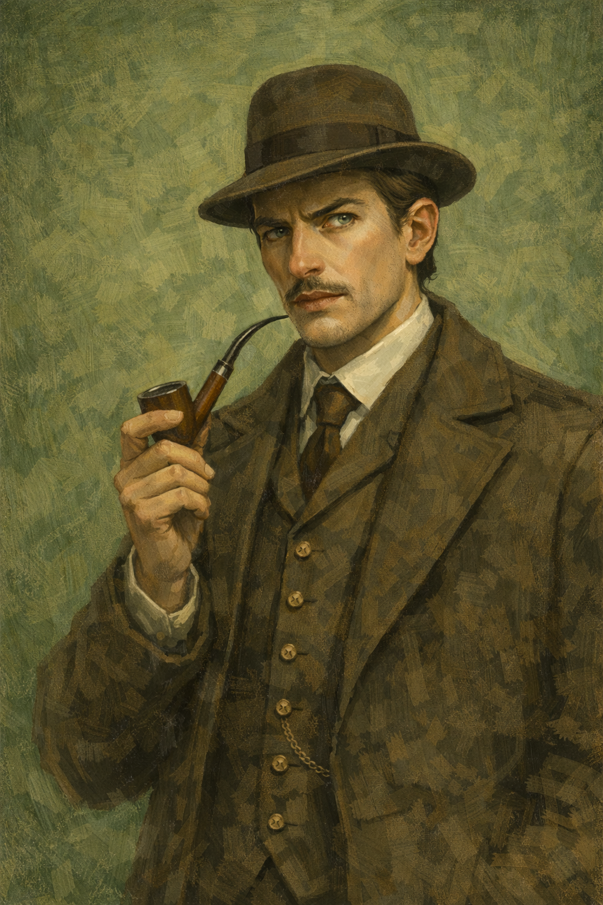
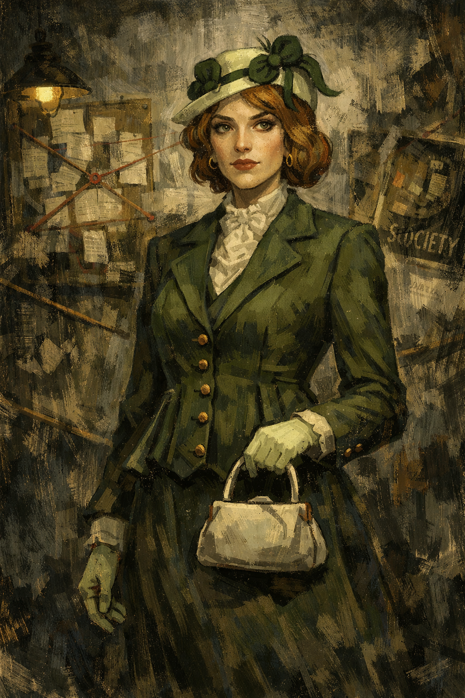
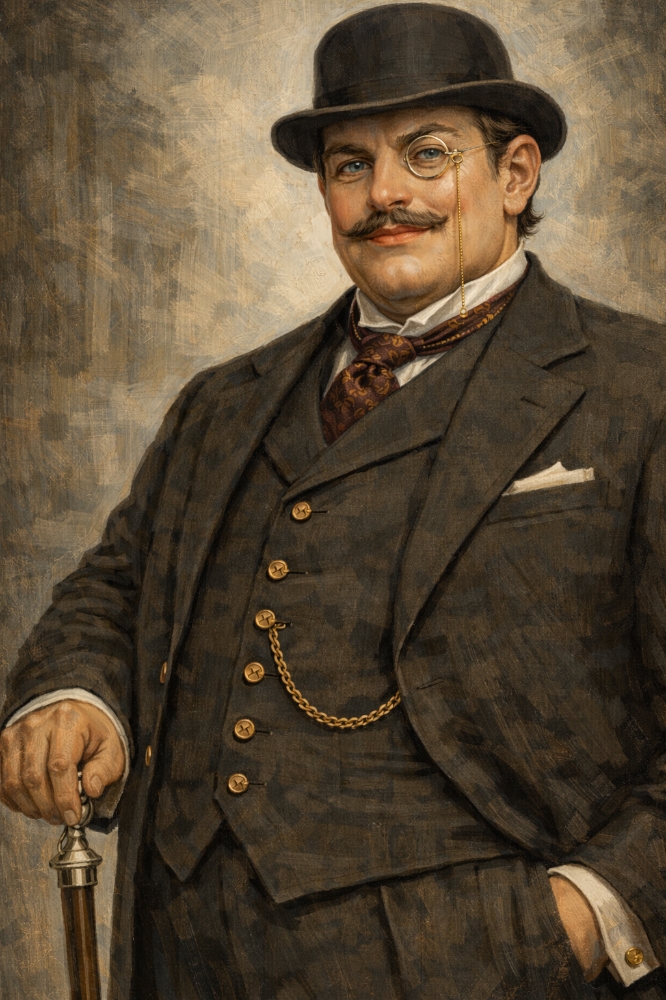
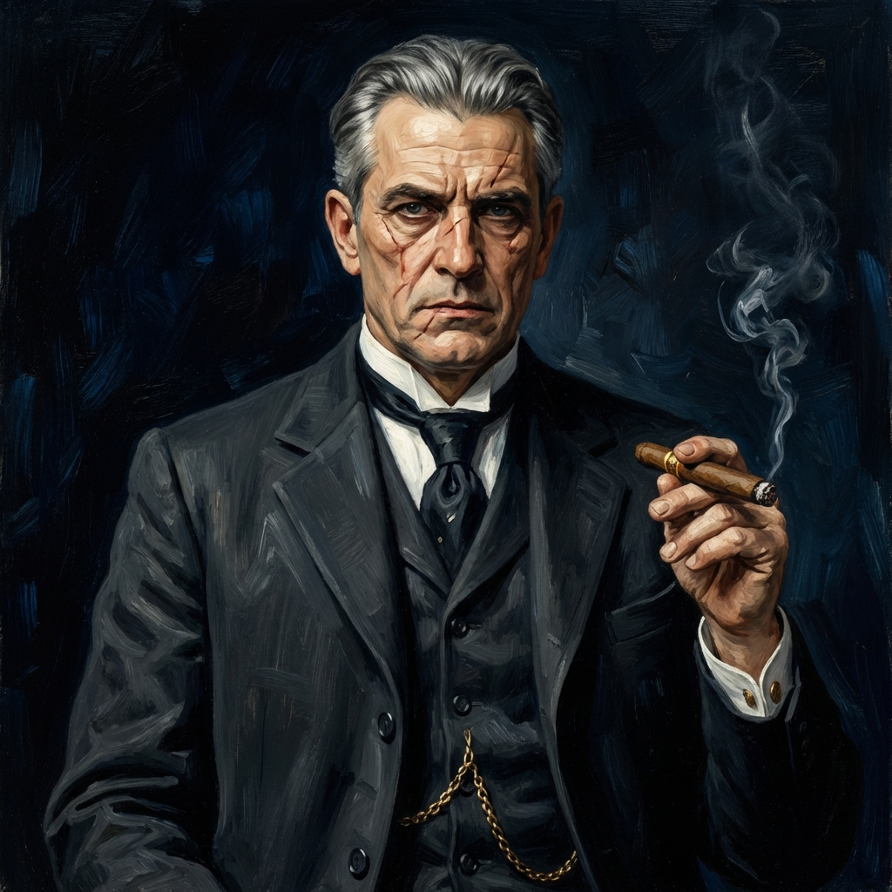
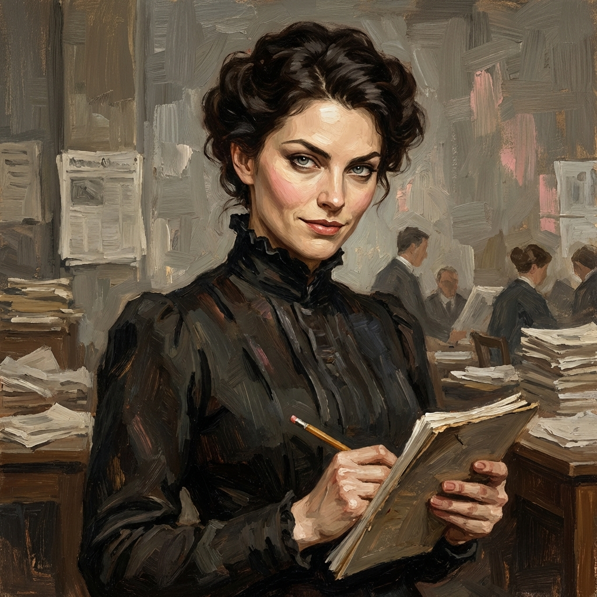
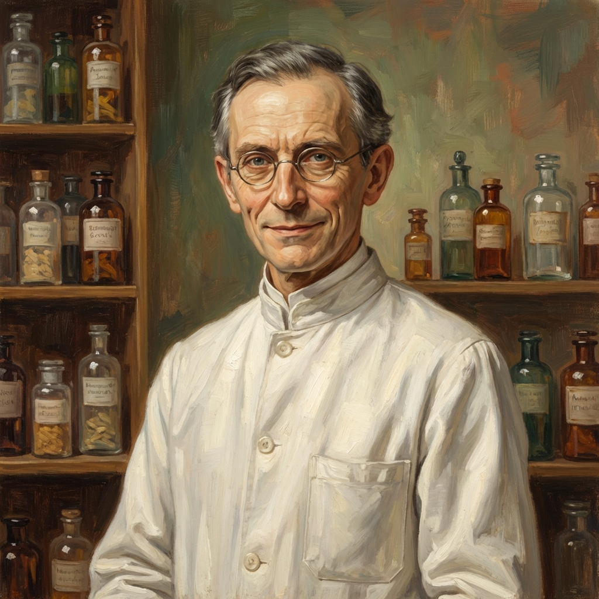
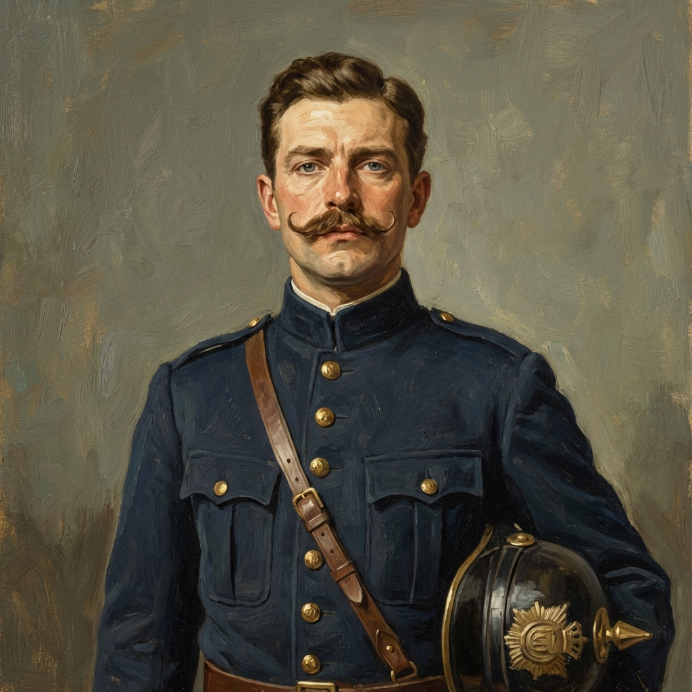

# 🗂️ Character Dossier

> **System Note**: This document serves as the narrative "Single Source of Truth". Game logic (IDs, stats) is enforced by `packages/shared/data/characters.ts`.
> The characters are organized into a strict 3-Tier Hierarchy.

---

## 🎭 Tier 1: The Cast (Major Characters)
*Drivers of the plot. These characters have full psychological profiles, distinct voices, and can evolve based on player choices.*

### Arthur Vance (The Detective)

- **Visuals**: A man in his mid-30s with sharp, analytical features and intense blue eyes. He sports a neatly trimmed mustache and is rarely seen without his brown fedora and matching checkered wool overcoat.
- **Role**: Protagonist / Private Investigator
- **Archetype**: Selectable Background (Noir Hero)
- **Client**: Hired by Bankhaus Krebs via the Mayor's office.
- **Selectable Origins (Influences Stats & Dialogue):**
  1.  **The Veteran**: *Endurance* & *Authority*. Scars from the front.
  2.  **The Former Journalist**: *Shivers* & *Rhetoric*. Knows the city's underbelly. Left the press to pursue truths that headlines couldn't handle.
  3.  **The Academic**: *Logic* & *Encyclopaedia*. Alumni of Freiburg University.
  4.  **The Ruined Noble**: *Composure* & *Suggestion*. A fallen aristocrat.
- **Hidden Trait**: Sensitive to the "Other Side" (Occult/Weird Freiburg).

### Victoria Sterling ("The Woman in the Iron Lab Coat")

- **Archetype**: The Pioneer / The Rebel Scientist.
- **Visuals**: Severe, practical dress (*Reformkleid*), ink-stained fingers, smells faintly of chemicals. Carries a heavy leather satchel like a weapon. Rigid, arms-crossed posture.
- **Background**: One of the very first female students at Freiburg University (women were only allowed to matriculate in Baden in 1900). She is surrounded by men who think her brain is biologically incapable of science.
- **Explicit Motive**: Prove her scientific competence to the male-dominated police force and university faculty.
- **Hidden Motive (The Secret)**: Her fiancé didn't just die; he was murdered because he discovered a new method of synthesizing Saccharin (illegal but highly profitable) or a dangerous chemical weapon. She is hunting his killers.
- **Character Conflict**: **Logic vs. Rage**. She tries to be the coldest, most rational person in the room to counter the "hysterical woman" stereotype, but inside she is burning with anger.
- **Voice**: `Forensics` (She speaks in chemical formulas and medical latin).

### Lotte Fischer ("The Spider in the Wire")

- **Archetype**: The Information Broker.
- **Visuals**: Deceptively innocent. Pastel dresses, always busy with her hands (knitting, sorting papers). Wears a headset like a crown. Auburn hair and observant eyes.
- **Role**: The Player's lifeline. She manages the "Board" (Quest Log/Map).
- **Explicit Motive**: Helping her father (the Polizeidirektor) solve the case to protect his failing health.
- **Hidden Motive**: Lotte is running her own game. She records conversations and keeps a ledger of secrets—who is sleeping with whom, who is bribing whom. She uses this info to pay off her brother's gambling debts to the crime syndicates.
- **Key Mechanic**: **"Lotte's Gossip"**. The player can call her to get hints, but every hint has a "social cost" or requires trading a secret found elsewhere.

### Heinrich Galdermann ("The Architect of Greed")

- **Archetype**: The Corrupt Pillar of Society.
- **Visuals**: Massive, immovable. Expensive three-piece pinstripe suit, gold watch chain, bowler hat, and monocle. His office smells of cigars and old leather.
- **Explicit Motive**: Recover the stolen gold/cash to prevent a bank run.
- **Hidden Motive**: The robbery is a cover-up. The vault was already empty—embezzled to fund bad investments in the colonies or the *Stadttheater* construction. He needs the robbery to claim insurance and hide his fraud.
- **Personality**: Treats people like assets. Dismissive of the Detective, terrified of the Press.

### Bruno Kessler ("The King of the Tunnels")

- **Archetype**: The Shadow King.
- **Visuals**: Formidable man with iron-grey hair and deep facial scars. Wears an expensive tuxedo with the ease of a predator. Smokes a thick cigar.
- **Domain**: The **Saccharin Smuggling** trade. He controls the "White Powder" flow from Switzerland through the Höllental railway and the brewery tunnels beneath Schlossberg.
- **Explicit Motive**: Protect his territory from police and rival gangs.
- **Hidden Motive**: He wants legitimacy. He is trying to buy his way into the *Burgess* (City Council). The bank robbery interferes with his plans to become "respectable."
- **Twist**: He might not be the robber. He might be an ally of convenience, as the robbery brings too much "heat" to his operations.

---

## 🛠️ Tier 2: The City's Gears (Functional NPCs)

### Dr. Ernst Schiller (The Coroner)

- **Motive**: Scientific vanity. He is obsessed with the new method of *Bertillonage* (measuring criminals) and dismisses fingerprints as "French nonsense."
- **Conflict**: Hates Victoria Sterling (a woman invading his morgue). The player must navigate this feud to get autopsy results.
- **Visuals**: Gaunt, sunken-faced, clutching a scalpel with bony hands.

### Anna Mahler (The Journalist)

- **Motive**: The "Big Scoop." She wants to expose the hypocrisy of the Freiburg elite (the pious Catholics who visit brothels, the rich bankers who smuggle sugar).
- **Role**: Can leak information to the public to pressure suspects, but might leak your secrets too.
- **Visuals**: Sharp features, severe black dress, smirk of a professional cynic.

### Herr Adalbert Weiss (The Apothecary)

- **Location**: Löwen-Apotheke (Münsterplatz).
- **Secret**: He is the "Fence" for chemical goods. He sells the ether and pure alcohol needed by the saccharin smugglers. He is a nervous man, easily intimidated.

---

## 👥 Tier 3: The Crowd (Atmospheric Archetypes)

### Friedrich (The Corps Student)
- **Visuals**: Bright Yellow Cap (*Corps Suevia*), fresh dueling scar on cheek. Drunk, loud, arrogant.
- **Function**: Blocks paths, demands "satisfaction" (duels), protects upper-class suspects.

### Old Gustav (The Bächleputzer)
- **Visuals**: Wizened man with a rake, wading in the canals.
- **Function**: Finds items dropped in the water (**Evidence retrieval**). "The water forgets nothing."

### The "Saccharin-Maud" (The Smuggler)
- **Visuals**: Bulky skirts hiding pockets of powder, anxious demeanor.
- **Function**: Random encounters, couriers of the underworld.

### Fritz Müller (The Gendarme / Schutzmann)

- **Archetype**: The Authority of the Street.
- **Visuals**: Pickelhaube helmet, meticulously pressed uniform, stiff soldierly bearing.
- **Historical Context (1905)**:
    - **Rank**: *Polizeisergeant* (Police Sergeant) - effectively a street beat cop but with NCO authority.
    - **Background**: Ex-military (likely 9-12 years service). Disciplined, stiff, Prussian mannerisms.
- **Voice & Etiquette**:
    - **Self-Introduction**: "Schutzmann Müller, Polizeidirektion Freiburg!" (Official) or "Polizeisergeant Müller. Ihre Papiere, bitte." (To an equal/superior).
    - **Salute**: Always touches visor/helmet before speaking.
    - **Address**: Uses "Euer Gnaden" (Your Grace) for nobles, "Mein Herr" for gentlemen. Calls himself "Schutzmann" or accepts "Herr Wachtmeister" as a polite honorific.
- **Function**: Blocks areas, checks papers, provides "official" rumors.
